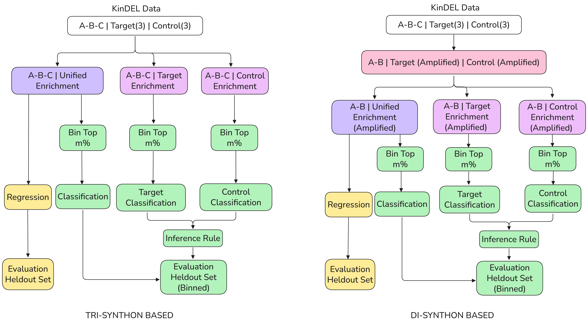

# Deepchem-DEL

Deepchem-DEL is an open-source platform for reproducible and scalable machine learning on DNA-encoded libraries (DELs). It provides a configurable denoising pipeline and modular DeepChem workflows for hit prediction, enrichment analysis, and benchmarking.

Deepchem-DEL is built on top of DeepChem-Server, a minimal cloud infrastructure for DeepChem. This foundation allows Deepchem-DEL to run scalable ML workflows in the cloud, manage experiments efficiently, and provide reproducible results with minimal setup. By leveraging DeepChem-Server, users can focus on DEL modeling and benchmarking without worrying about the underlying computational infrastructure.

Benchmarked on the KinDEL dataset, Deepchem-DEL reproduces key baselines across diverse models, enabling streamlined DEL modeling with minimal engineering overhead.

## Table of Contents
- [Installation](#installation)
- [Project structure](#project-structure)
- [Datasets](#datasets)
- [Denoising and Task Setup](#denoising-and-task-setup)
- [Quick Start](#quick-start)
- [Held-out analysis](#held-out-analysis)
- [Citations](#citations)

---

## Installation

### Create Local Python environment

Install pyds on local python environment

### Run the service with Docker (recommended for server)
```bash
# From repo root
cd deepchem_server
./docker.sh
```
The API will be available at `http://localhost:8000` with interactive docs at `http://localhost:8000/docs`.

---

## Project structure
```text
├── deepchem-del/                    # Benchmarking + high-level client pipeline over the server
   ├── benchmark/
   │   ├── configs/                 # Example benchmark configs (yaml/json)
   │   ├── *                        # Benchmark entrypoints for unified and non-unified disynthons and trisynthons
   │   └── ...
   ├── utils/
   │   ├── pipeline.py              # Featurize → split → train → evaluate → infer pipeline client
   │   ├── denoise_utils.py
   │   └── logging_utils.py
   └── tests/
```

---

## Datasets

We utilized the [KinDEL](https://arxiv.org/abs/2410.08938) dataset, a publicly available DNA-encoded library (DEL) resource comprising over 80 million small molecules screened against two kinase targets, MAPK14 and DDR1. For our experiments, we selected the 1 million compound subset recommended by KinDEL, which strikes a balance between chemical diversity and computational tractability.

Each target in the KinDEL dataset is accompanied by two sequence count measures:
SEQ target (target) and SEQ matrix (control), with three independent experimental repli-
cates available for both. By default, molecular structures are provided in Trisynthon SMILES
format, along with the corresponding constituent synthons. Across all three synthon posi-
tions, we identified 1,641 unique synthons in the MAPK14 dataset and 1,660 unique synthons
in the DDR1 dataset.

---

## Denoising and Task Setup

Our experimental design follows two sequential denoising choices:

1. Amplified (disynthon) v/s Non-amplified (tri-synthon). In the non-amplified
baseline, compounds are represented as raw tri-synthons with sequencing counts taken di-
rectly from selection experiments. In the amplified setting, tri-synthons are collapsed into
disynthons, which aggregates counts from multiple tri-synthons into fewer structures. The
detailed experimental pipelines for tri-synthons and disynthons are shown in the figure below.

2. Unified v/s Non-unified. For both amplified and non-amplified data, we compared
non-unified models, trained separately for each target and its control, against unified models,
trained jointly across targets. Unified models were implemented as either classification (hit
vs. non-hit) or regression (predicting enrichment values).
The classification task was constructed by binning molecules such that the molecules
with respective enrichment scores in top 10% were labeled as hits (1) and the remainder as
non-hits (0). The 10 percentile choice here can be considered as a sensitivity setting for the
classification task.

*Fig1: Overview of experimental design. Left: trisynthon-based pipeline using raw
compound representations and direct sequencing counts. Right: disynthon-based pipeline
with amplified sequencing counts obtained by collapsing trisynthons into disynthons. Both
pipelines proceed through unified/non-unified denoising strategies and are evaluated on held-
out KinDEL datasets.*


---

## Quick Start

### 1. Configuration Structure

Deepchem-DEL uses YAML configuration files to define complete ML workflows. Each config specifies the denoising pipeline, featurization, model training, evaluation, and inference parameters. For example, the unified trisynthon regression configuration (`uni_tri_reg_config.yaml`) includes: `denoise_config` for data preprocessing with control/target sequence columns and aggregation operations, `featurizer_config` for molecular featurization (e.g., ECFP fingerprints), `split_config` for train/validation/test splits, `train_config` for model specification (e.g., Random Forest regressor), `evaluate_config` for performance metrics, and `infer_config` for prediction settings. This modular approach enables reproducible experiments across different denoising strategies, model types, and target tasks.

### 2. Benchmark

Benchmark scripts live in `deepchem-del/benchmark/` and are configured via YAML files in `deepchem-del/benchmark/configs/`.

Run a unified disynthon classification benchmark (example):
```bash
python deepchem-del/benchmark/unified_disynthon_classification.py \
  --config deepchem-del/benchmark/configs/uni_di_class_config.yaml
```

Inspect and modify these configs to point to your datasets and adjust model/training parameters.

---

## Held-out analysis


---

## Citations

